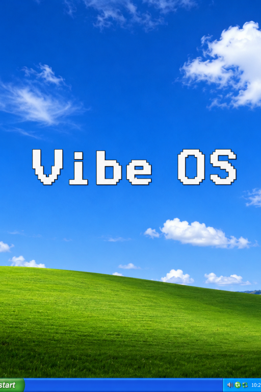

# VibeOS: WWW Edition

一个基于 Microsoft Build 2026 Vibe OS 演示概念复刻并继续扩展的单页 HTML AI 操作系统沙盒。



## 简介

VibeOS: WWW Edition 是一个AI幻觉驱动的操作系统，它运行在一个 `VibeOS.html` 文件中，包含类 Windows XP 的桌面、开始菜单、任务栏、多窗口、设置、通知、浏览器、命令行、文件管理器、桌面文件、拖拽交互、应用记忆和系统调用能力。

核心目标是让用户像使用一台真实电脑一样操作 AI：

- 打开应用；
- 点击、输入、提交命令；
- 在应用之间拖拽文字、图片、文件或应用快捷方式；
- 让 AI 根据当前界面、历史情节和系统状态继续更新 UI；
- 通过通知、打开应用、虚拟安装应用等系统调用演出跨应用事件。

## 主要特性

- **单文件运行**：源码集中在 `VibeOS.html`，可直接在浏览器中打开。
- **类桌面系统**：桌面、窗口、任务栏、开始菜单、设置、通知、回收站等基础 OS 外壳。
- **AI 动态 UI**：应用首屏和后续交互可由 AI 生成或更新。
- **应用级记忆**：每个应用保存情节摘要、最近交互和当前 HTML 快照。
- **全局系统状态**：AI 可感知当前运行中的应用及其最新状态。
- **跨应用拖拽**：文本、图片、文件、桌面对象和应用快捷方式可拖入窗口或桌面。
- **预置应用**：浏览器、命令行、文件管理器提供内置模板，同时可继续触发 AI 更新。
- **系统调用**：支持通知、打开应用、虚拟安装应用、创建桌面文件等受控能力。
- **主题与设置**：支持 API 配置、世界观/主线/用户设定、主题管理、存储占用查看。

## 文件结构

```text
Vibe OS/
├─ VibeOS.html   # 主程序，包含 HTML/CSS/JS
├─ VibeOS.png    # 酒馆角色卡版
├─ 预览.png      # 预览图
└─ README.md     # 项目说明
```

## 使用方式

1. 用浏览器打开 `VibeOS.html`。
2. 进入“设置”配置文本模型 API。
3. 如需生图，在“设置”中配置图片 API。
4. 从开始菜单或桌面图标启动应用。
5. 像使用普通电脑一样点击、输入、拖拽和切换窗口。

## API 支持

文本模型：

- OpenAI Responses API；
- OpenAI 兼容 Chat Completions 代理；
- Google AI Studio Gemini API；
- SillyTavern 环境。

图片模型：

- LoremFlickr 占位图片；
- NovelAI；
- OpenAI Images。

## 设计说明

VibeOS: WWW Edition 的核心不是预设功能，而是“操作后果生成”。

系统会把用户动作、当前 UI 快照、应用情节记忆、长期记忆和全局系统状态拼装进 prompt，由 AI 返回可 patch 的 HTML 片段，并通过 `sys-summary` 保存一句话情节摘要。这样可以减少上下文膨胀，同时让 AI 理解当前操作路径。

## 当前状态

这是一个实验性项目，适合探索 AI 原生 UI、桌面叙事、虚拟应用和跨应用演绎。

仍需继续改进的方向包括：

- 更稳定的移动端布局与触摸交互；
- 更丰富的系统调用白名单；
- 更完善的桌面文件模型；
- 更细粒度的权限和确认机制；
- 更完整的可视化测试。

## 致谢

感谢 Microsoft Build 2026 Vibe OS 演示带来的灵感。

感谢 Steve Sanderson 大佬。

